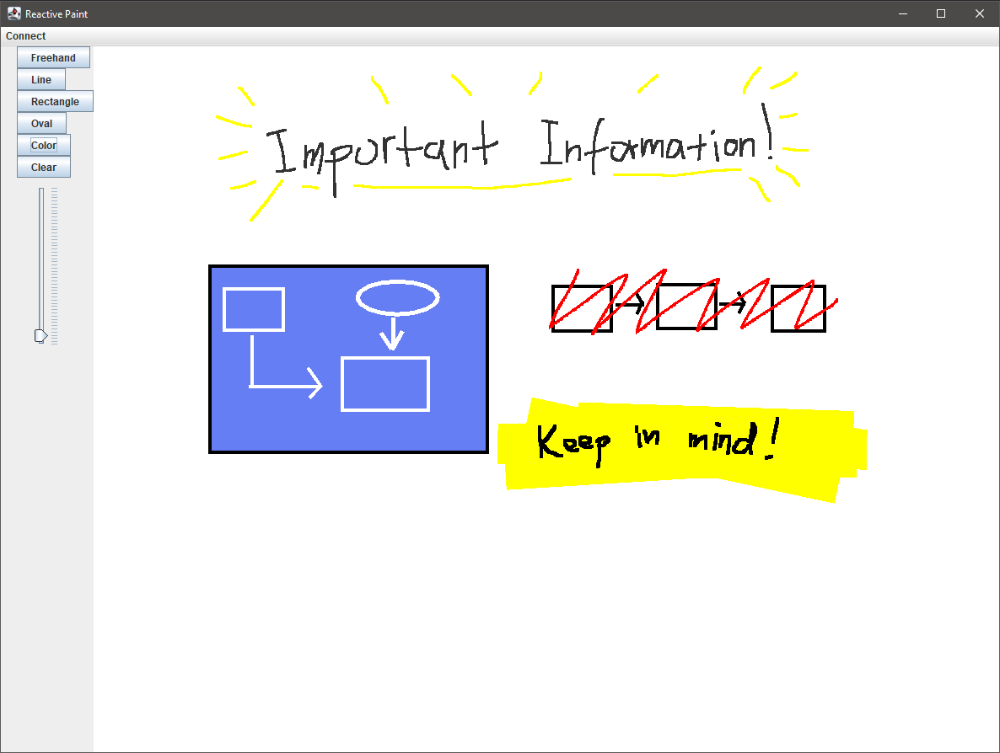

# Reactive Paint
A digital whiteboard built with RxJava that lets several users see and draw on it at the same time.

## Table of Contents
* [Purpose](#purpose)
* [Built with](#built-with)
* [Key Features](#key-features)
* [Setup](#setup)
* [Usage](#usage)
* [Contact](#contact)

## Purpose
This project was mainly created as a learning opportunity to improve my understanding of 
reactive programming and implement a client-server model using sockets on a network. Its 
asynchronous and parallel design lets multiple users draw and view each other's creations 
simultaneously without any blocking or interruptions. To achieve this, many of RxJava's features 
were utilized, including multicasting, combining observables, and scheduling.

## Built with
- RxJava 3 - version 3.1.5
- Java Swing - JDK14
- Maven - version 3.6.3

## Key Features
- Easy-to-use graphical user interface
- Lets multiple users on a network connect to a shared session
- Several tools for drawing, such as freehand, line and various shapes
- Ability to change the color and thickness of lines

## Setup
Requires Maven (tested with 3.6.3 as earliest version) and JDK14+. After cloning the project, 
follow these steps to build and run it:

1. Navigate to project directory
2. Build the project with maven, using the command: `mvn install`
3. A jar file is created in the target directory. You can navigate to it from the project 
   directory with: `cd target`
4. Run the generated jar file, e.g.: `java -jar reactive-paint-0.0.1-SNAPSHOT-jar-with-dependencies.jar`

## Usage

* You can select which tool you want to draw with from the right-hand side: *freehand*, *line*, 
  *rectangle* or *oval*.
* Use the cursor on the whiteboard to draw using the selected tool.
* You can change the color and thickness from the right-hand side as well.
* If the whiteboard is getting too cluttered, you can also press *clear* to remove everything on 
  your own whiteboard.

You can also host a session that other users on the network can connect to, or connect to 
another user's session.

* To host, select *Connect > Host* from the top menu. You will get a pop-up with the port number 
  that you are now hosting on. The port number is also displayed in the window title. Other 
  users can now connect to your session using that port number.
* To join a hosted session, select *Connect > Join* from the top menu. You will be asked to 
  enter the port number of the host you want to connect to. After connecting to a host, you will 
  see everything that has been drawn in that session, and everything you draw will be seen by 
  all connected users.

## Contact
Created by [Simon Karlsson](mailto:a.simon.karlsson@gmail.com) - feel free to contact me!